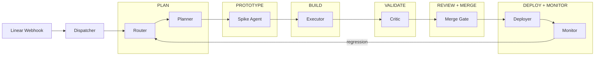

# Pipeline Overview

> Reference document for the Linear-Hermes 6-stage factory pipeline.
> Each stage is an autonomous agent step driven by Linear state transitions.

## Architecture



## Stages

### PLAN

Three-phase upfront analysis before any code is written. Runs as a GitHub Actions workflow
with three sequential jobs, each posting a Linear comment.

| Field | Value |
|---|---|
| **Trigger** | Linear state transitions to `Ready` (after Router triage passes) |
| **Actions** | 1. **Ticket Triage** — deep AC quality, scope, dependency, and repo-context assessment. 2. **Feedback Digest** — consolidate comments/discussion into structured requirements. 3. **PRD Outline** — synthesize into a Product Requirements Document with success criteria, approach, and risks. |
| **Inputs** | Linear issue (description, comments, attachments), repo ARCHITECTURE.md |
| **Outputs** | Three Linear comments (triage assessment, feedback digest, PRD outline), `pipeline-stage` set to `spec`, workflow state transitioned to `Planned` |
| **Workflow** | `.github/workflows/plan.yml` — runs `ticket-triage` → `feedback-digest` → `prd-outline` skills |
| **Skills** | `.agents/skills/plan/ticket-triage.md`, `.agents/skills/plan/feedback-digest.md`, `.agents/skills/plan/prd-outline.md` |

### PROTOTYPE

Validate risky or unknown aspects of the plan through throwaway experiments before committing to the full build. Skips if the plan is straightforward.

| Field | Value |
|---|---|
| **Trigger** | `pipeline-stage: spec` and plan contains `infra_needed: true` or spike recommendations |
| **Actions** | 1. Spin up isolated sandbox. 2. Run throwaway experiment (API call, library test, DB query). 3. Report findings in a Linear comment. 4. Update `pipeline-stage: implement` or loop back to PLAN. |
| **Inputs** | Plan comment, spike description, repo code |
| **Outputs** | Linear comment with findings, updated `pipeline-stage` field |
| **Service** | (planned — spike-agent) tied to `executor` sandbox or external Codex/Claude Code agent |

### BUILD

Implement the plan: write production code, add tests, and open a pull request.

| Field | Value |
|---|---|
| **Trigger** | `pipeline-stage: implement` (or Linear state `planned`) |
| **Actions** | 1. Clone/fetch repo. 2. Create feature branch. 3. Write code per plan steps. 4. Run tests (local). 5. Commit and push. 6. Open GitHub PR. 7. Post PR link in Linear comment. 8. Set `pipeline-stage: review`. |
| **Inputs** | Plan comment, repo code, staging environment variables |
| **Outputs** | GitHub PR, Linear comment with PR link, `pipeline-stage` updated to `review` |
| **Service** | `executor-service` (port 8664) — delegates to Hermes agent with tool access |

### VALIDATE

Automated quality gates: security scan, dependency audit, linter, test results, and structural review before human eyes touch the PR.

| Field | Value |
|---|---|
| **Trigger** | `pipeline-stage: review` (or Linear state `in-review`) |
| **Actions** | 1. Fetch PR diff. 2. Run security scan (imports, secrets, injection). 3. Check dependency freshness. 4. Validate test coverage. 5. Check architecture compliance. 6. Post review summary as PR review comment. 7. Set `pipeline-stage: verify`. |
| **Inputs** | GitHub PR diff, repo structure, security rules |
| **Outputs** | PR review comment (approve / request changes), `pipeline-stage` updated to `verify` |
| **Service** | `critic-service` (port 8665) |

### REVIEW + MERGE

Human-in-the-loop or autonomous merge gate. Confirms validation passed, checks CI status, and merges to main.

| Field | Value |
|---|---|
| **Trigger** | `pipeline-stage: verify` and all CI checks passing |
| **Actions** | 1. Re-check validation outputs. 2. Verify CI status (GitHub Actions). 3. If auto-merge enabled: squash-merge PR. 4. Delete feature branch. 5. Post merge summary in Linear. 6. Set `pipeline-stage: complete`. |
| **Inputs** | Validation report, CI status, merge rules |
| **Outputs** | Merged PR, deleted branch, Linear comment with merge summary |
| **Service** | Merge gate — part of `critic-service` or separate `dispatcher` logic |

### DEPLOY + MONITOR

Deploy the merged code to the target environment and monitor key metrics for regressions.

| Field | Value |
|---|---|
| **Trigger** | PR merged to main, `pipeline-stage: complete` |
| **Actions** | 1. Trigger deployment (GitHub deploy workflow, rsync, Docker deploy). 2. Verify deployment health (HTTP 200, DB migrations). 3. Monitor for 15 minutes (error rates, latency). 4. Report deployment status in Linear. 5. Close the issue. |
| **Inputs** | Merged commit SHA, deploy config, health check endpoints |
| **Outputs** | Deployment log, monitoring dashboard snapshot, Linear issue closed |
| **Service** | (planned — deploy-agent) hooks into GitHub Actions deploy workflow + health checks |

## Stage-to-State Mapping

How the 6 factory stages map to Linear states and custom fields.

### Linear Workflow States

| Pipeline Stage | Linear State | Custom Field `pipeline-stage` | Custom Field `triage-state` |
|---|---|---|---|
| **PLAN** | `ready` / `planned` | `spec` | `ready-to-spec` |
| **PROTOTYPE** | `planned` | `spec` | `in-implementation` (spike) |
| **BUILD** | `planned` → `in-review` | `implement` | `in-implementation` |
| **VALIDATE** | `in-review` | `review` | `in-review` |
| **REVIEW + MERGE** | `in-review` → `done` | `complete` | `in-verification` → `done` |
| **DEPLOY + MONITOR** | `done` (kept) | `complete` | `done` |

### Data Flow

```
Issue Created
    │
    ▼
┌──────────────────────────────────────────────────────┐
│  DISPATCHER  (port 8660)                              │
│  Receives webhook → reads issue.state.name → routes   │
│  to the right stage service by state                  │
└──────────────────────────────────────────────────────┘
    │
    ▼ (state: needs-triage)
┌──────────────────────────────────────────────────────┐
│  ROUTER  (port 8661)                                  │
│  Verifies repo, ACs, scope → emits ready or blocked   │
│  Output: state → ready / blocked                      │
└──────────────────────────────────────────────────────┘
    │
    ▼ (state: ready → pipeline-stage: spec)
┌──────────────────────────────────────────────────────┐
│  PLANNER  (port 8663)                                 │
│  Decomposes issue, writes plan, provisions infra      │
│  Output: plan comment + pipeline-stage → implement    │
└──────────────────────────────────────────────────────┘
    │
    ▼ (pipeline-stage: implement → state: planned)
┌──────────────────────────────────────────────────────┐
│  EXECUTOR  (port 8664)                                │
│  Implements plan, writes code, runs tests, opens PR   │
│  Output: PR link + state → in-review                  │
└──────────────────────────────────────────────────────┘
    │
    ▼ (state: in-review → pipeline-stage: review)
┌──────────────────────────────────────────────────────┐
│  CRITIC  (port 8665)                                  │
│  Reviews diff, security scan, deps, merge gate        │
│  Output: review comment + state → done / planned      │
└──────────────────────────────────────────────────────┘
    │
    ▼ (approved — pipeline-stage: complete)
┌──────────────────────────────────────────────────────┐
│  MERGE GATE  (dispatcher or critic)                   │
│  Verifies CI, squash-merges, deletes branch           │
│  Output: merged PR + issue closed                     │
└──────────────────────────────────────────────────────┘
    │
    ▼ (merged to main)
┌──────────────────────────────────────────────────────┐
│  DEPLOY / MONITOR  (planned service)                  │
│  Deploys to target env, health checks, regression mon │
│  Output: deploy log + monitoring report               │
└──────────────────────────────────────────────────────┘
```

## Service Port Map

| Service | Port | Status |
|---|---|---|
| Dispatcher (webhook router) | 8660 | Active |
| Router | 8661 | Active |
| Planner | 8663 | Active |
| Executor | 8664 | Active |
| Critic | 8665 | Active |
| Merge Gate | shared | Part of dispatcher/critic |
| Deploy Agent | TBD | Planned |
| Monitor Agent | TBD | Planned |

## Current Prototype vs. Full Factory

The current `linear-pipeline-prototype` implements stages **PLAN → BUILD → VALIDATE** (via Router→Planner→Executor→Critic). Stages **PROTOTYPE**, **REVIEW+MERGE** (fully automated), and **DEPLOY+MONITOR** are planned additions.

What exists now:
- Dispatcher routes by Linear workflow state
- Router verifies issue readiness
- Planner writes implementation plans
- Executor implements code and opens PRs
- Critic reviews diffs and runs quality gates

What comes next:
- **PROTOTYPE**: Spike agent for validating risky unknowns
- **REVIEW+MERGE**: Autonomous merge gate with CI integration
- **DEPLOY+MONITOR**: Deploy workflow + regression monitoring

## Custom Fields

Two Select-type custom fields on the Playground team drive stage transitions:

- **triage-state**: `unprocessed` → `ready-to-implement` / `ready-to-spec` / `needs-info` / `wait-to-implement` → `in-implementation` → `in-review` → `in-verification` → `done`
- **pipeline-stage**: `triage` → `spec` → `implement` → `review` → `verify` → `complete`

Set via `scripts/setup-custom-fields.py`.
